# FieldReady architecture

This document explains how the FieldReady frontend, backend, database, authentication, offline queue, review workflow, and future AI capabilities fit together.

## 1. System overview

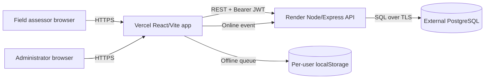

The frontend and backend are deployed separately from the same GitHub monorepo. Vercel serves the compiled static frontend. Render runs the Express API. PostgreSQL is an external managed database and is the durable source of truth. The browser queue is only a temporary synchronization buffer.

## 2. Monorepo boundaries

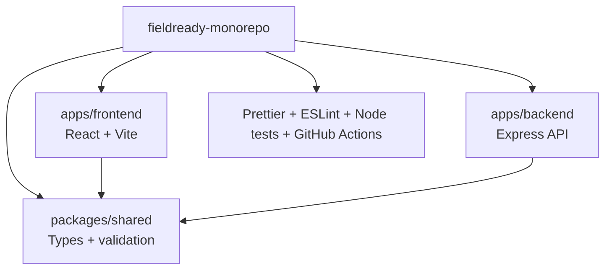

`packages/shared` prevents the browser and API from drifting on domain values such as `Good`, `Moderate`, `Bad`, review statuses, assessment status, access status, and urgency options.

## 3. Backend request flow

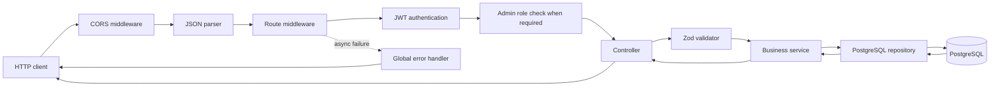

The layers have distinct responsibilities:

| Layer        | Responsibility                                                  |
| ------------ | --------------------------------------------------------------- |
| Routes       | Register URLs and middleware                                    |
| Middleware   | Authenticate requests, authorize admins, forward async failures |
| Controllers  | Parse HTTP input and shape HTTP responses                       |
| Validators   | Reject malformed or unsafe request payloads                     |
| Services     | Apply business rules such as ownership and review locking       |
| Repositories | Execute parameterized PostgreSQL queries                        |
| Database     | Persist users, assessments, reviews, and registration limits    |

## 4. Authentication and authorization

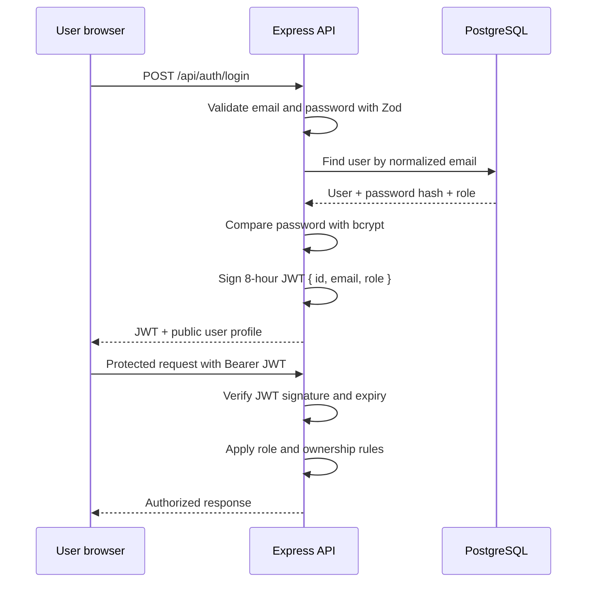

Registration can create assessor accounts only. Administrator accounts are created or updated by the seed command using server-side environment variables. A browser cannot select the `admin` role.

## 5. Data ownership model

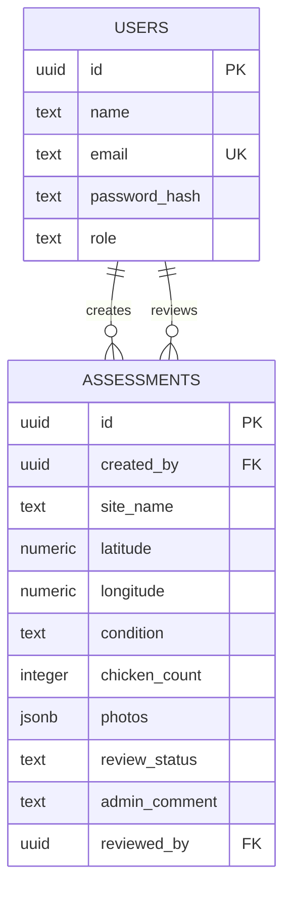

Every new assessment receives `created_by` from the verified JWT user ID. It is never trusted from the request body.

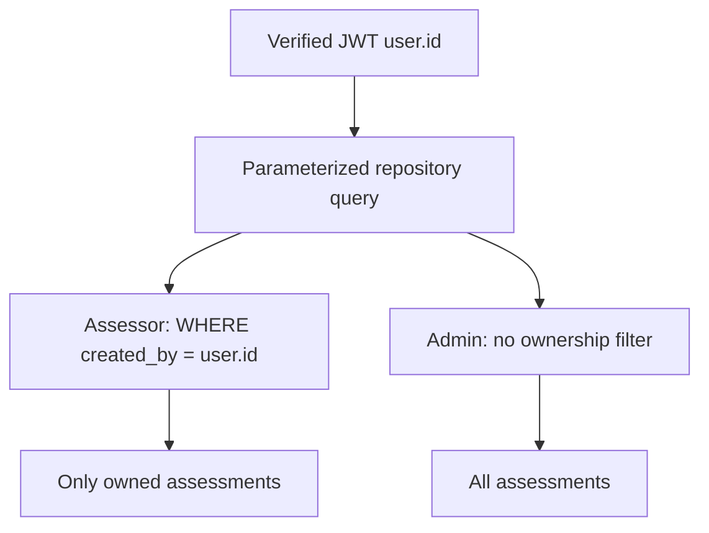

Ownership is enforced for list, create/update, status, delete, and summary operations. The frontend restrictions are a usability layer; the backend and database queries provide the security boundary.

## 6. Offline submission and synchronization

```mermaid
sequenceDiagram
    participant F as Field browser
    participant Q as User-scoped local queue
    participant API as Express API
    participant DB as PostgreSQL

    F->>F: Check navigator.onLine
    alt Online and API reachable
        F->>API: POST assessment with JWT
        API->>DB: Validate, assign created_by, persist
        DB-->>API: Saved record
        API-->>F: Success
    else Offline or network failure
        F->>Q: Save record under queue:<user-id>
        F-->>F: Show queued count
        F->>F: Browser emits online event
        F->>API: Retry current user's queued records
        API->>DB: Persist each valid record
        API-->>F: Success or retryable failure
        F->>Q: Remove successful records; retain failed network records
    end
```

HTTP errors such as validation, authentication, or authorization failures are displayed rather than queued. This prevents invalid data from being treated as an internet outage. The current implementation uses `localStorage`; production should move to IndexedDB with encryption, retry backoff, idempotency keys, and a durable sync state.

## 7. Review lifecycle

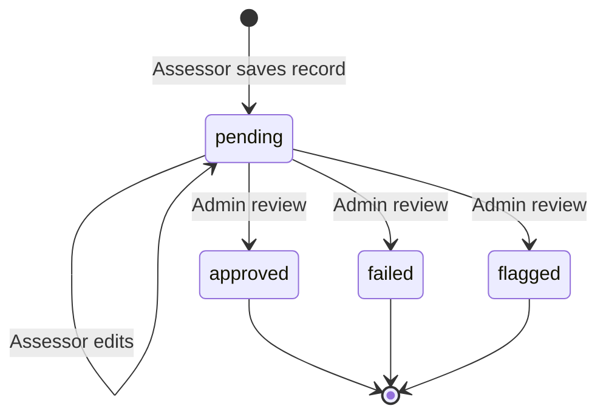

Once a record leaves `pending`, the backend rejects assessor edits. The assessor can see the review status and administrative comment for their own record. Administrators can update the review status and comment from the admin dashboard.

## 8. Admin analytics

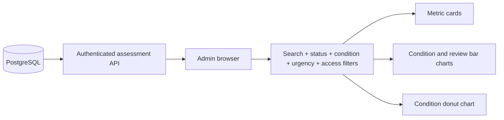

The admin dashboard currently loads the admin-authorized assessment set and calculates filtered metrics in the browser. This keeps the interview application simple and responsive. For large datasets, the same filter model can be moved into parameterized server-side reporting queries with pagination and aggregation.

## 9. Error handling

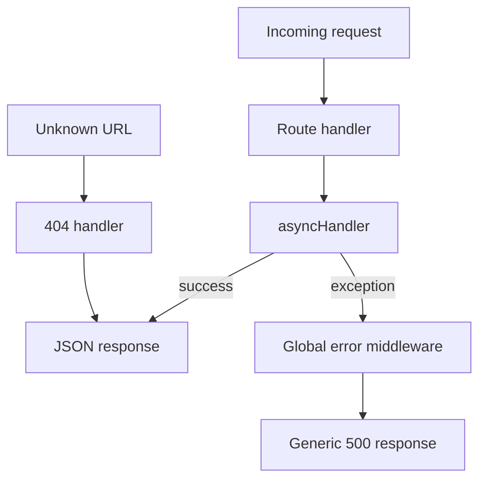

The API returns useful validation and authorization errors where appropriate. Unexpected errors return a generic message so stack traces, credentials, SQL details, and other internals are not sent to the browser.

## 10. Deployment topology

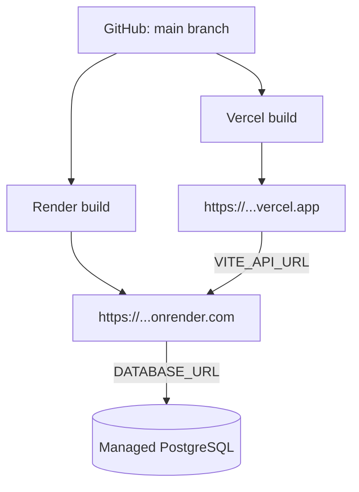

Vercel receives only the public `VITE_API_URL`. Render receives `DATABASE_URL`, `JWT_SECRET`, and `FRONTEND_URL`. Render injects `PORT` in production; it should not be hard-coded in the hosting configuration.

## 11. Future AI integration points

AI should be introduced behind the backend rather than called directly from the browser.

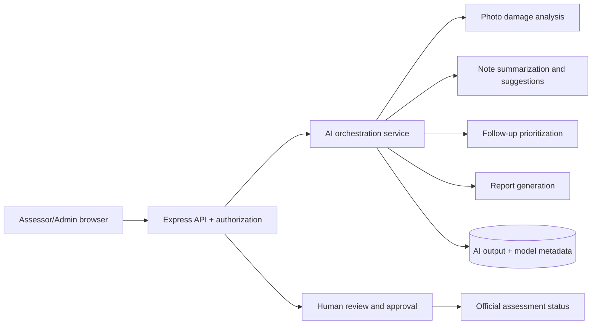

Potential integrations:

- **Photo triage:** identify likely structural or flood damage, with confidence scores.
- **Field assistance:** suggest condition, urgency, and missing-note prompts without overwriting human input.
- **Report generation:** create county summaries from approved assessments.
- **Prioritization:** rank sites using urgency, access, condition, chicken count, and history.
- **Quality assurance:** flag duplicate sites, improbable counts, missing photos, or coordinate anomalies.
- **Natural-language analytics:** translate safe admin questions into read-only filters.
- **Geospatial intelligence:** combine coordinates with flood zones, rainfall, roads, or elevation.

AI output should be stored separately from the original assessment, include model/version/confidence metadata, be auditable, and require human approval before changing an official review status. The API must enforce ownership before sending records to any AI provider, and sensitive images or personal data should follow explicit retention and consent policies.

## 12. Design trade-offs

| Decision                 | Reason                                                                 | Future improvement                                           |
| ------------------------ | ---------------------------------------------------------------------- | ------------------------------------------------------------ |
| Vercel + Render          | Simple free split deployment for static frontend and Node API          | Add paid always-on compute when latency matters              |
| PostgreSQL               | Reliable relational source of truth and transactional ownership limits | Add migrations tooling and backups for production operations |
| Client-side admin charts | Fast to build and suitable for small assessment datasets               | Move aggregation server-side for large datasets              |
| `localStorage` queue     | Zero additional service and easy interview demonstration               | Use encrypted IndexedDB and background sync                  |
| Data URLs for photos     | Self-contained prototype with no object-storage dependency             | Use object storage and store signed URLs                     |
| JWT bearer tokens        | Straightforward stateless API authentication                           | Add refresh-token rotation and stronger session controls     |
